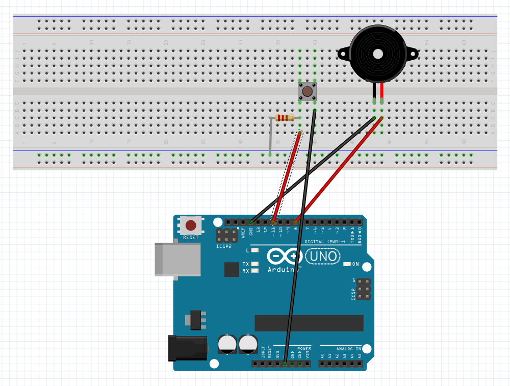

# megaloduino
this is just a small learning project for me that i made in a few hours when i first got my arduino uno. i don't know how good or bad my wiring is (probably horrible) but i know that my code is god awful and i apologise for that. i more just wanted to see if i could do this more than anything aha.

## schematics
if you wanna build this yourself for whatever unknown reason, here is how i set up my stuff. button is just there so you can play the music or pause it, as if you'd want to do that to this banger tho.

